# Meta Ads Data Warehouse — ERD

Generated for migration `0001_initial_schema`.  
Source of truth: `scripts/meta-ads-full-fetch-curl.sh` (Graph API v21.0).

```mermaid
erDiagram

  %% ── DIMENSION TABLES ──────────────────────────────────────────────────────

  businesses {
    string  id PK
    string  name
    string  verification_status
    string  timezone_id
    string  vertical
    jsonb   primary_page
    ts      created_time
    jsonb   raw
    ts      created_at
    ts      updated_at
    ts      last_synced_at
  }

  ad_accounts {
    string  id PK
    string  business_id FK
    string  account_id
    string  name
    int     account_status
    string  currency
    string  timezone_name
    numeric spend_cap
    string  amount_spent
    string  balance
    bool    is_client_account
    bool    is_personal
    bool    is_prepay_account
    string  tax_id_status
    ts      created_time
    jsonb   funding_source_details
    jsonb   capabilities
    jsonb   tos_accepted
    jsonb   rf_spec
    jsonb   raw
    ts      last_synced_at
  }

  campaigns {
    string  id PK
    string  account_id FK
    string  name
    string  status
    string  effective_status
    string  objective
    string  buying_type
    string  bid_strategy
    string  daily_budget
    string  lifetime_budget
    ts      start_time
    ts      stop_time
    bool    is_skadnetwork_attribution
    jsonb   special_ad_categories
    jsonb   promoted_object
    jsonb   issues_info
    jsonb   recommendations
    jsonb   raw
    ts      last_synced_at
  }

  ad_creatives {
    string  id PK
    string  account_id FK
    string  name
    string  status
    string  object_type
    string  call_to_action_type
    text    image_url
    text    link_url
    string  video_id
    text    thumbnail_url
    jsonb   object_story_spec
    jsonb   asset_feed_spec
    jsonb   degrees_of_freedom_spec
    jsonb   platform_customizations
    jsonb   raw
    ts      last_synced_at
  }

  adsets {
    string  id PK
    string  account_id FK
    string  campaign_id FK
    string  name
    string  status
    string  effective_status
    string  billing_event
    string  optimization_goal
    string  bid_strategy
    string  daily_budget
    string  lifetime_budget
    ts      start_time
    ts      end_time
    bool    is_dynamic_creative
    jsonb   targeting
    jsonb   attribution_spec
    jsonb   learning_stage_info
    jsonb   frequency_control_specs
    jsonb   issues_info
    jsonb   recommendations
    jsonb   raw
    ts      last_synced_at
  }

  ads {
    string  id PK
    string  account_id FK
    string  adset_id FK
    string  campaign_id FK
    string  creative_id FK
    string  name
    string  status
    string  effective_status
    ts      created_time
    ts      updated_time
    jsonb   tracking_specs
    jsonb   conversion_specs
    jsonb   ad_review_feedback
    jsonb   issues_info
    jsonb   recommendations
    jsonb   raw
    ts      last_synced_at
  }

  custom_audiences {
    string  id PK
    string  account_id FK
    string  name
    string  subtype
    bigint  approximate_count_lower_bound
    bigint  approximate_count_upper_bound
    bool    is_value_based
    string  pixel_id
    int     retention_days
    jsonb   rule
    jsonb   lookalike_spec
    jsonb   delivery_status
    jsonb   sharing_status
    jsonb   raw
    ts      last_synced_at
  }

  ads_pixels {
    string  id PK
    string  account_id FK
    string  name
    ts      last_fired_time
    bool    enable_automatic_matching
    string  data_use_setting
    jsonb   automatic_matching_fields
    jsonb   owner_business
    jsonb   raw
    ts      last_synced_at
  }

  custom_conversions {
    string  id PK
    string  account_id FK
    string  name
    string  custom_event_type
    numeric default_conversion_value
    ts      first_fired_time
    ts      last_fired_time
    bool    is_archived
    jsonb   rule
    jsonb   pixel
    jsonb   data_sources
    jsonb   raw
    ts      last_synced_at
  }

  product_catalogs {
    string  id PK
    string  business_id FK
    string  name
    int     product_count
    string  vertical
    jsonb   da_display_settings
    jsonb   raw
    ts      last_synced_at
  }

  product_sets {
    string  id PK
    string  catalog_id FK
    string  name
    int     product_count
    jsonb   filter
    jsonb   raw
    ts      last_synced_at
  }

  product_feeds {
    string  id PK
    string  catalog_id FK
    string  name
    string  country
    bool    deletion_enabled
    jsonb   schedule
    jsonb   latest_upload
    jsonb   update_schedule
    jsonb   raw
    ts      last_synced_at
  }

  %% ── FACT TABLES (monthly partitioned on date) ──────────────────────────────

  insights_daily {
    string  ad_id PK
    date    date PK
    string  attribution_window PK
    string  account_id
    string  campaign_id
    string  adset_id
    bigint  impressions
    bigint  reach
    numeric frequency
    numeric spend
    numeric cpm
    numeric cpc
    numeric ctr
    bigint  clicks
    numeric purchase_roas_value
    string  quality_ranking
    string  conversion_rate_ranking
    jsonb   actions
    jsonb   action_values
    jsonb   conversions
    jsonb   purchase_roas
    jsonb   video_play_actions
    ts      synced_at
  }

  insights_daily_breakdown {
    string  ad_id PK
    date    date PK
    string  attribution_window PK
    string  breakdown_type PK
    string  breakdown_key_hash PK
    jsonb   breakdown_key
    string  campaign_id
    string  adset_id
    bigint  impressions
    numeric spend
    numeric ctr
    jsonb   actions
    jsonb   purchase_roas
    ts      synced_at
  }

  insights_adset_daily {
    string  adset_id PK
    date    date PK
    string  attribution_window PK
    string  account_id
    string  campaign_id
    bigint  impressions
    numeric spend
    numeric ctr
    jsonb   actions
    jsonb   purchase_roas
    ts      synced_at
  }

  insights_campaign_daily {
    string  campaign_id PK
    date    date PK
    string  attribution_window PK
    string  account_id
    bigint  impressions
    numeric spend
    numeric ctr
    jsonb   actions
    jsonb   purchase_roas
    ts      synced_at
  }

  insights_account_daily {
    string  account_id PK
    date    date PK
    string  attribution_window PK
    bigint  impressions
    numeric spend
    numeric ctr
    jsonb   actions
    jsonb   purchase_roas
    ts      synced_at
  }

  %% ── OPERATIONAL TABLES ─────────────────────────────────────────────────────

  sync_runs {
    bigint  id PK
    string  entity_type
    string  account_id
    ts      started_at
    ts      finished_at
    string  status
    int     rows_upserted
    int     request_count
    string  async_report_run_id
    jsonb   error
  }

  api_rate_limits {
    bigint  id PK
    ts      recorded_at
    string  account_id
    text    endpoint
    jsonb   business_use_case_usage
    jsonb   ad_account_usage
    jsonb   app_usage
  }

  pixel_event_stats_daily {
    bigint  id PK
    string  pixel_id FK
    string  account_id
    date    date
    string  event_name
    bigint  count
    ts      synced_at
  }

  %% ── RELATIONSHIPS ───────────────────────────────────────────────────────────

  businesses           ||--o{ ad_accounts           : "owns"
  businesses           ||--o{ product_catalogs       : "owns"
  ad_accounts          ||--o{ campaigns              : ""
  ad_accounts          ||--o{ adsets                 : ""
  ad_accounts          ||--o{ ads                    : ""
  ad_accounts          ||--o{ ad_creatives           : ""
  ad_accounts          ||--o{ custom_audiences       : ""
  ad_accounts          ||--o{ ads_pixels             : ""
  ad_accounts          ||--o{ custom_conversions     : ""
  campaigns            ||--o{ adsets                 : ""
  campaigns            ||--o{ ads                    : ""
  adsets               ||--o{ ads                    : ""
  ad_creatives         ||--o{ ads                    : ""
  ads                  ||--o{ insights_daily         : ""
  ads                  ||--o{ insights_daily_breakdown : ""
  adsets               ||--o{ insights_adset_daily   : ""
  campaigns            ||--o{ insights_campaign_daily : ""
  ad_accounts          ||--o{ insights_account_daily : ""
  ads_pixels           ||--o{ pixel_event_stats_daily : ""
  product_catalogs     ||--o{ product_sets           : ""
  product_catalogs     ||--o{ product_feeds          : ""
```

## Index summary

| Table | Index | Type |
|---|---|---|
| campaigns | account_id, effective_status | btree |
| adsets | account_id, campaign_id, effective_status | btree |
| ads | account_id, adset_id, campaign_id, effective_status | btree |
| ad_creatives | account_id | btree |
| custom_audiences | account_id | btree |
| ads_pixels | account_id | btree |
| custom_conversions | account_id | btree |
| insights_daily | (account_id, date DESC), (campaign_id, date DESC), (adset_id, date DESC) | btree |
| insights_daily | actions, action_values | GIN |
| insights_daily_breakdown | (ad_id, date DESC) | btree |
| insights_daily_breakdown | actions, breakdown_key | GIN |
| insights_adset_daily | (account_id, date DESC) | btree |
| insights_campaign_daily | (account_id, date DESC) | btree |
| insights_account_daily | (account_id, date DESC) | btree |
| sync_runs | status, entity_type | btree |
| pixel_event_stats_daily | (pixel_id, date DESC) | btree |
| all dimension tables | raw | GIN |
